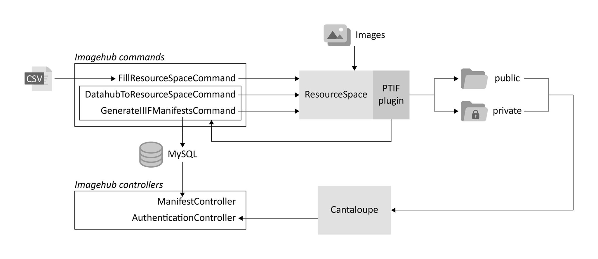

# Imagehub

## Project overview



The Imagehub provides a link between [ResourceSpace](https://www.resourcespace.com) and the [Datahub](https://github.com/thedatahub/Datahub). Data from the Datahub is added to resources in ResourceSpace and [IIIF Presentation API](https://iiif.io/api/presentation/2.1/) manifests are generated for each resource so they can be displayed in a IIIF viewer.

## Requirements

The Imagehub installation requires the following components:

* PHP >= 7.1
* MySQL or MariaDB database server
* Apache or NGinx webserver
* [Cantaloupe](https://cantaloupe-project.github.io/) >= 4.1
* [ResourceSpace](https://www.resourcespace.com/get) >= 9.1 with the [RS_ptif](https://github.com/kmska/RS_ptif) plugin installed, this may be installed on a different server

If authentication is required to access certain resources (for example images that are only meant for internal use), you also need the following:
* Active Directory Federation Service on your local network
* The [Cantaloupe delegate script](https://github.com/kmska/cantaloupe_delegate) set up in your Cantaloupe installation folder

Locally installed IIIF viewers are also handy to have, for example [Mirador](https://projectmirador.org/) or [Universal Viewer](https://universalviewer.io/).

## Preparation

Your ResourceSpace installation requires a specific set of metadata fields. You can set this up by using the resourcespace_metadata_fields.sql file included in this project, this will drop and recreate the resource_type_field table.

Certain metadata fields, most notably dropdown lists (for example Publisher and Cleared for usage) need to be prefilled with the necessary values before adding resources. This can be done either manually through the admin console of ResourceSpace or by using the resourcespace_node_values.sql included in this project.

The Imagehub itself also requires its very own database containing a table 'iiif_manifest' according to the following structure:
```
CREATE TABLE `iiif_manifest` (
  `id` int UNSIGNED NOT NULL AUTO_INCREMENT,
  `manifest_id` varchar(255) NOT NULL,
  `data` longtext NOT NULL,
  PRIMARY KEY (`id`)
);
```
A MySQL user is to be created with full access to this table. The username, password and database name can be freely chosen and are configured in the .env file in this repository.

## Installation

### Imagehub installation
Clone this repository:
```
git clone https://github.com/kmska/ImageHub.git Imagehub
```

Copy the .env.sample file to .env and the config/imagehub.yaml.sample file to config/imagehub.yaml. Edit any values according to your local setup in .env and config/imagehub.yaml. At the very least, the following values should be checked and edited where needed:

In .env:
* DATABASE_URL=mysql://(user):(pass)@(host):(port)/(db_name)

In config/imagehub.yaml:
* ResourceSpace API
    * resourcespace_api_url
    * resourcespace_api_username
    * resourcespace_api_key
* Datahub URL and LIDO record id prefix
    * datahub_url
    * datahub_record_id_prefix
* Cantaloupe URL
    * cantaloupe_url
* URL to be embedded in manifests for private images, along with a whitelist of IPs that do not need to authenticate
    * authentication_url
    * authentication_whitelist


Then, install the Imagehub through [composer](https://getcomposer.org/):
```
cd Imagehub
composer install
```

### Webserver configuration

Next up, the necessary Apache or Nginx configuration should be written in order to access both the Imagehub itself and the SimpleSAMLphp package which provides authentication with the ADFS.
A sample Apache configuration file may look like this:
```
<VirtualHost _default_:443>

    DocumentRoot "/opt/ImageHub/public"
    ServerName <imagehub_url>:443

    SetEnv SIMPLESAMLPHP_CONFIG_DIR /opt/ImageHub/vendor/simplesamlphp/simplesamlphp/config

    Alias /simplesaml /opt/ImageHub/vendor/simplesamlphp/simplesamlphp/www

    SSLProxyEngine On
    ProxyPass /cantaloupe/iiif/2 https://<imagehub_url>:8183/iiif/2
    ProxyPassReverse /cantaloupe/iiif/2 https://<imagehub_url>:8183/iiif/2

    <Directory /opt/ImageHub/public>
      <IfModule !mod_authz_core.c>
        # For Apache 2.2:
        AllowOverride All
        Order allow,deny
        Allow from all
      </IfModule>
      <IfModule mod_authz_core.c>
        # For Apache 2.4:
        AllowOverride All
        Require all granted
      </IfModule>
    </Directory>
    <Directory /opt/ImageHub/vendor/simplesamlphp/simplesamlphp/www>
      <IfModule !mod_authz_core.c>
        # For Apache 2.2:
        AllowOverride All
        Order allow,deny
        Allow from all
      </IfModule>
      <IfModule mod_authz_core.c>
        # For Apache 2.4:
        AllowOverride All
        Require all granted
      </IfModule>
    </Directory>
</VirtualHost>
```
This will provide the following:
* An SSL-enabled virtual host on the domain 'imagehub.kmska.local' (keep in mind you'll need a valid SSL certificate for this), pointing to the directory /opt/Imagehub/public
* An admin console to help set up and test your simplesamlphp installation
* A reverse proxy that points to your Cantaloupe image server, in order to prevent issues with Cross-Origin Resource Sharing (CORS) in a IIIF viewer.

### SimpleSAMLphp setup
Now we can set up SimpleSAMLphp to provide authentication through the Active Directory Federation Services. We need to set up the following files for this, in the vendor/simplesamlphp/simplesamlphp/ folder:
* cert/saml.crt
* cert/saml.key
* config/acl.php
* config/authmemcookie.php
* config/authsources.php
* config/config.php
* metadata/saml20-idp-remote.php
* metadata/saml20-sp-remote.php

From the command line:
```
openssl req -x509 -nodes -sha256 -days 3653 -newkey rsa:2048 -keyout saml.key -out saml.crt
```
Then copy the saml.key and saml.crt to the cert/ folder.

Next, copy the configuration templates to the config/ folder:
```
cp config-templates/* config/
```

Generate a secret salt:
```
LC_CTYPE=C tr -c -d '0123456789abcdefghijklmnopqrstuvwxyz' </dev/urandom | dd bs=32 count=1 2>/dev/null;echo
```

In config.php, find secretsalt and edit it with the output from the above command.
Also edit auth.adminpassword to a safe password of your choosing.

To AD FS:
Windows Administrative Tools, AD FS Management
In AD FS, Service, Endpoints. Under Metadata, find the URL, such as:
/FederationMetadata/2007-06/FederationMetadata.xml

Browse to https://<imagehub_url>/simplesaml/  
* Tab Federation (Federatie)
* Tools
* XML to SimpleSAMphp metadata converter.

Either use 'Choose file' and enter the URL or browse to https://[your_adfs_login_service]/FederationMetadata/2007-06/FederationMetadata.xml and copy-paste the content.

Click 'Parse'.

Copy-paste the content under saml20-sp-remote to metadata/saml20-sp-remote.php and the content under saml20-idp-remote to metadata/saml20-idp-remote.php.

Make sure both files start with ``<?php``, the parser does not generate these.


In config/authsources.php, replace the block 'default-sp' with the following:
```
  // An authentication source which can authenticate against both SAML 2.0
  // and Shibboleth 1.3 IdPs. If you make any configuration changes, you will need
  // to update the RPT at the IdP.
  'default-sp' => array(
      'saml:SP',

      // The entity ID of this SP.
      // Can be NULL/unset, in which case an entity ID is generated based on the metadata URL.
      'entityID' => null,

      // The entity ID of the IdP this should SP should contact.
      // Can be NULL/unset, in which case the user will be shown a list of available IdPs.
      'idp' => 'http://[your_adfs_login_service]/adfs/services/trust',

      // The URL to the discovery service.
      // Can be NULL/unset, in which case a builtin discovery service will be used.
      'discoURL' => null,

      // ADFS requires signing of the logout - the others are optional (may be overhead you don't want.)
      'sign.logout' => TRUE,
      'redirect.sign' => TRUE,
      'assertion.encryption' => TRUE,

      // We now need a certificate and key. The following command (executed on Linux usually)
      // creates a self-signed cert and key, using SHA256, valid for 2 years.
      // openssl req -x509 -nodes -sha256 -days 730 -newkey rsa:2048 -keyout my.key -out my.pem
      'privatekey' => 'saml.key',
      'certificate' => 'saml.crt',

      // Enforce the use of SHA-256 by default.
      'signature.algorithm' => 'http://www.w3.org/2001/04/xmldsig-more#rsa-sha256'
  ),
```

Browse to https://<imagehub_url>/simplesaml/ again.
* Tab Federation (Federatie)
* Under 'SAML 2.0 SP Metadata'
* Copy the value next to 'Entity ID:'

Go back to AD FS. Relying Party Trusts. At the right, 'Add relying party trust'.
* Claims aware
* Import data about the relying party published online or on a local network (first option), paste the 'Entity ID' value from the previous step into the field.
* Next
* Ignore the warning
* Enter any display name and additional notes
* Next
* Next
* Configure claims issuance policy for this application, make sure it is checked
* Close

Select the new value in the list, click 'Edit Claim Issuance Policy...'

Add rule
* Send LDAP Attribute as Claims
* Next
* Claim rule name: 'UPN'
  * Attribute store: Active Directory
  * LDAP attributes: User-Principal-Name, Outgoing Claim Type: UPN
  * LDAP attributes: Token-Group - Unqualified Names: Outgoing Claim Type: Group

Add rule
  * Transform an incoming Claim
  * Claim rule name: 'Outgoing name identifier'
  * Incoming claim type: UPN
  * Outgoing claim type: Name ID
  * Outgoing name ID format: Transient Identifier
  * Check 'Pass through all claim values'

Browse to https://<imagehub_url>/simplesaml/ again.
* Tab Authentication
* Test configured authentication sources
* default-sp

Now you should see your claim attributes.


**Note**: it is highly recommended to create a seperate directory containing an exact copy of the above files, as updating the packages (through composer update), may cause any files in the vendor/simplesamlphp/simplesamlphp to be lost.

### RS_ptif and Cantaloupe delegate configuration

Once the Imagehub is correctly installed, it is important to edit the appropriate config values in the RS_ptif ResourceSpace plugin and Cantaloupe delegate script so they correctly point to your newly installed Imagehub.

## Usage

Once all is set up correctly, in theory all you need to do is upload images to ResourceSpace, making sure the following metadata fields are correctly set upon uploading:
* Publisher
* Inventory number (of artwork/object)
* Cleared for usage
* Recommended image for publication

However, you can also perform bulk uploads of images without providing an inventory number. In this case, you can upload as many images to ResourceSpace as you like (keeping in mind to still set the Cleared for usage and Recommended image for publication fields) and then upload a CSV file onto the Imagehub server through FTP. It is important that each header of this CSV file has the same name as the shorthand name of the metadata fields in ResourceSpace. Also beware of any leading or trailing characters in the CSV header.

The 'datecreatedofartwork' CSV values should have the following format: 'yyyy-mm-dd, yyyy-mm-dd', indicating a first and last date. However, it may also be split up in two columns, 'datecreatedofartwork-start' and 'datecreatedofartwork-end', each of which may contain a date in 'yyyy', 'yyyy-mm' or 'yyyy-mm-dd' format. The command will then automatically merge both into 'datecreatedofartwork' and append month/day values where needed.

You can then execute the following command:
```
bin/console app:csv-to-resourcespace csv_file_with_data.csv
```

This command will match each row in the CSV with each resource in ResourceSpace by original_filename.

If the RS_ptif plugin is correctly installed and configured in your ResourceSpace installation, then the following command will be called with the resource ID as parameter:
```
bin/console app:datahub-to-resourcespace resource_id
```
This will fetch the appropriate data from the Datahub and add it to the resource. It will also fetch data for any related resources and add it to those resources.

After this, the following command will be called, also with the resource ID as parameter:
```
bin/console app:generate-iiif-manifests resource_id
```
This will generate a IIIF manifest for the resource and any resources related to it, then store it in MySQL. The manifest can be accessed from a URL as such: https://<imagehub_url>/iiif/2/512/manifest.json, where '512' stands for the ID of the resource in ResourceSpace.

To update the data and generate manifests for all resources you can run the above commands without arguments. This can be useful to perform a daily update through crontab:
```
bash /opt/imagehub/bin/console app:generate-iiif-manifests resource_id
bash /opt/imagehub/bin/console app:datahub-to-resourcespace resource_id
```

The Imagehub also provides the appropriate logging. Logs are stored in var/logs/.


## Troubleshooting

If you get any errors while uploading images, you may try the following:

Execute the following command(s) from the command line to check for any errors:
```
bin/console app:datahub-to-resourcespace resource_id -v
bin/console app:generate-iiif-manifests resource_id -v
```
